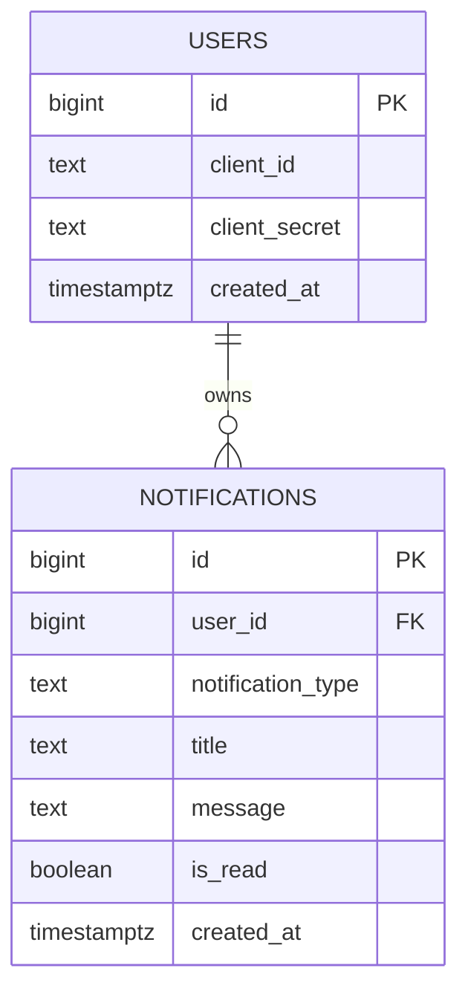
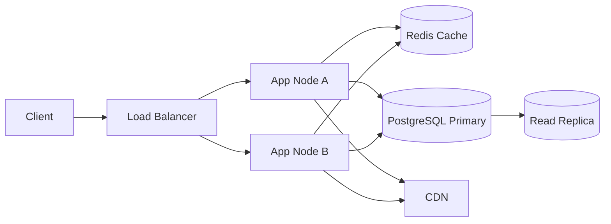
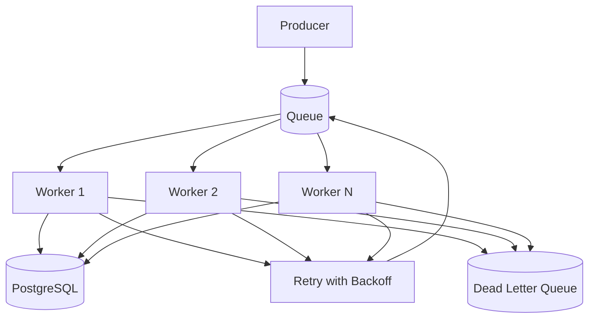

# Campus Notification Platform — System Design

## Stage 1: REST API Design

### Authentication
- `POST /register`
- Headers: `Content-Type: application/json`
- Request body: `{ "accessCode": "string" }`
- Response body: `{ "clientId": "string", "clientSecret": "string" }`

- `POST /auth`
- Headers: `Content-Type: application/json`
- Request body: `{ "clientId": "string", "clientSecret": "string" }`
- Response body: `{ "accessToken": "string" }`

### Notifications
- `GET /notifications`
- Headers: `Authorization: Bearer <token>`
- Query params:
  - `page`: number
  - `limit`: number
  - `notification_type`: `Event | Result | Placement`
- Response body:
  - `notifications`: notification array
  - `total`: total records
  - `totalPages`: total pages

### Logging
- `POST /logs`
- Headers: `Content-Type: application/json`
- Request body:
  - `stack`
  - `level`
  - `package`
  - `message`
- Response body: empty or acknowledgement payload

### Error Format
```json
{
  "success": false,
  "error": {
    "code": "BAD_REQUEST",
    "message": "Invalid request"
  }
}
```

## Stage 2: PostgreSQL Schema

### Tables
```sql
CREATE TABLE users (
  id BIGSERIAL PRIMARY KEY,
  client_id TEXT NOT NULL UNIQUE,
  client_secret TEXT NOT NULL,
  created_at TIMESTAMPTZ NOT NULL DEFAULT NOW()
);

CREATE TABLE notifications (
  id BIGSERIAL PRIMARY KEY,
  user_id BIGINT NOT NULL REFERENCES users(id) ON DELETE CASCADE,
  notification_type TEXT NOT NULL,
  title TEXT NOT NULL,
  message TEXT NOT NULL,
  is_read BOOLEAN NOT NULL DEFAULT FALSE,
  created_at TIMESTAMPTZ NOT NULL DEFAULT NOW()
);
```

### Indexes
```sql
CREATE INDEX idx_notifications_user_type_created_at
  ON notifications (user_id, notification_type, created_at DESC);

CREATE INDEX idx_notifications_unread_by_user
  ON notifications (user_id, created_at DESC)
  WHERE is_read = FALSE;

CREATE INDEX idx_notifications_type_created_at
  ON notifications (notification_type, created_at DESC);
```

### Filtering and Pagination Queries
```sql
SELECT id, notification_type, title, message, is_read, created_at
FROM notifications
WHERE user_id = $1
  AND ($2::text IS NULL OR notification_type = $2)
ORDER BY created_at DESC
LIMIT $3 OFFSET (($4 - 1) * $3);
```

```sql
SELECT COUNT(*)
FROM notifications
WHERE user_id = $1
  AND is_read = FALSE;
```

### ER Diagram


## Stage 3: Query Optimization

- The composite index on `(user_id, notification_type, created_at)` supports the most common read path: per-user, type-filtered, newest-first pagination.
- The partial unread index keeps unread inbox reads fast without paying the write and storage cost for read rows.
- Ordering by `created_at DESC` aligns with the UI feed and avoids a separate sort for the most common query shape.
- `EXPLAIN ANALYZE` should confirm an index scan on the filtered user/type path and a low-cost count plan for unread totals.

```sql
EXPLAIN ANALYZE
SELECT id, notification_type, title, message, is_read, created_at
FROM notifications
WHERE user_id = $1
  AND notification_type = $2
ORDER BY created_at DESC
LIMIT 10 OFFSET 0;
```

## Stage 4: Scaling Strategy

- Use horizontal app scaling behind a load balancer; keep the application stateless.
- Cache notification counts and hot pages in Redis with short TTLs.
- Add read replicas for notification listing and analytics-heavy reads.
- Serve static assets through a CDN to reduce origin pressure.
- Apply rate limiting per client and per endpoint to protect the API surface.



## Stage 5: Bulk Notification Architecture

- Use a queue-based pipeline for bulk dispatch and fan-out.
- A worker pool consumes jobs, writes notifications in batches, and retries transient failures with exponential backoff.
- Failed jobs move to a dead letter queue after the retry budget is exhausted.
- Throughput estimate: with 8 workers processing 50 jobs/sec each, sustained throughput is roughly 400 jobs/sec before downstream bottlenecks.


